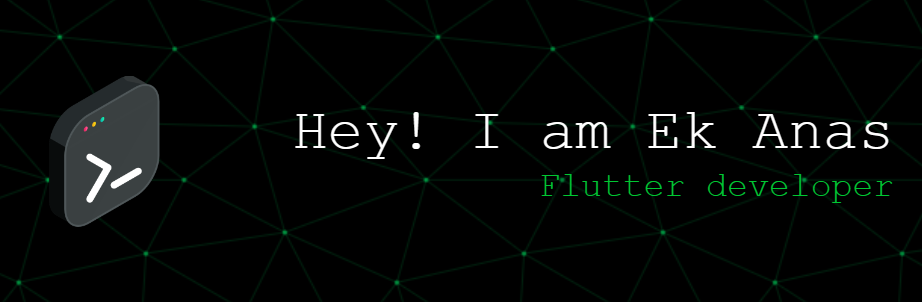

<h1 align="center">Hi 👋, I'm Ek Anas</h1>
<h3 align="center">A passionate flutter developer</h3>

  

  

- 🌱 I’m currently learning **Framework,Backend Node js,React**

- 👨‍💻 All of my projects are available at [https://ekanaz.github.io/EKANAS/](https://ekanaz.github.io/EKANAS/)

- 📫 How to reach me **ekanazek@gmail.com**

<h3 align="left">Connect with me:</h3>

<h3 align="left">Languages and Tools:</h3>

           

&nbsp;

